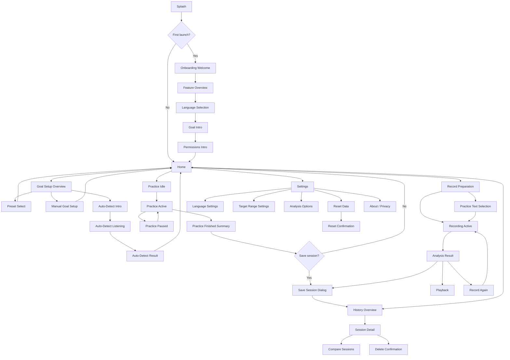
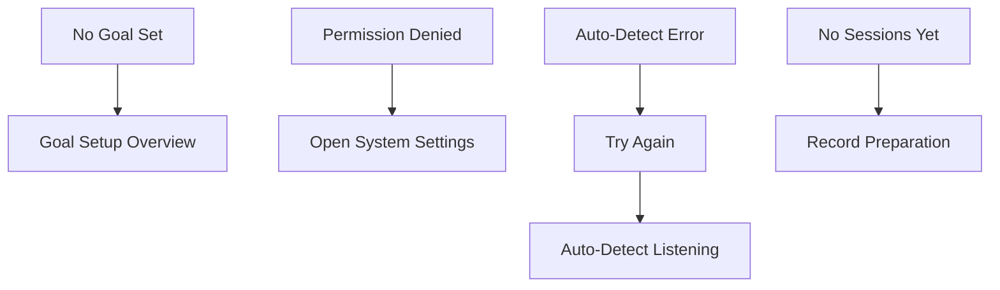

# Voxa – Flow Diagramme

## Hauptflow

```mermaid
flowchart TD
    A[Splash] --> B{First launch?}
    B -->|Yes| C[Onboarding Welcome]
    B -->|No| H[Home]

    C --> D[Feature Overview]
    D --> E[Language Selection]
    E --> F[Goal Intro]
    F --> G[Permissions Intro]
    G --> H[Home]

    H --> I[Goal Setup Overview]
    I --> I1[Preset Select]
    I --> I2[Manual Goal Setup]
    I --> I3[Auto-Detect Intro]

    I3 --> I4[Auto-Detect Listening]
    I4 --> I5[Auto-Detect Result]
    I5 --> H
    I1 --> H
    I2 --> H

    H --> J[Practice Idle]
    J --> K[Practice Active]
    K --> L[Practice Paused]
    L --> K
    K --> M[Practice Finished Summary]
    M --> N{Save session?}
    N -->|Yes| O[Save Session Dialog]
    N -->|No| H
    O --> P[History Overview]
    P --> Q[Session Detail]
    Q --> R[Compare Sessions]
    Q --> S[Delete Confirmation]

    H --> T[Record Preparation]
    T --> U[Practice Text Selection]
    T --> V[Recording Active]
    U --> V
    V --> W[Analysis Result]
    W --> X[Playback]
    W --> O
    W --> Y[Record Again]
    Y --> V

    H --> P
    H --> Z[Settings]
    Z --> Z1[Language Settings]
    Z --> Z2[Target Range Settings]
    Z --> Z3[Analysis Options]
    Z --> Z4[Reset Data]
    Z --> Z5[About / Privacy]
    Z4 --> Z6[Reset Confirmation]
```

## Fehler- und Sonderzustände

```mermaid
flowchart TD
    A[No Goal Set] --> B[Goal Setup Overview]
    C[Permission Denied] --> D[Open System Settings]
    E[Auto-Detect Error] --> F[Try Again]
    F --> G[Auto-Detect Listening]
    H[No Sessions Yet] --> I[Record Preparation]
```
