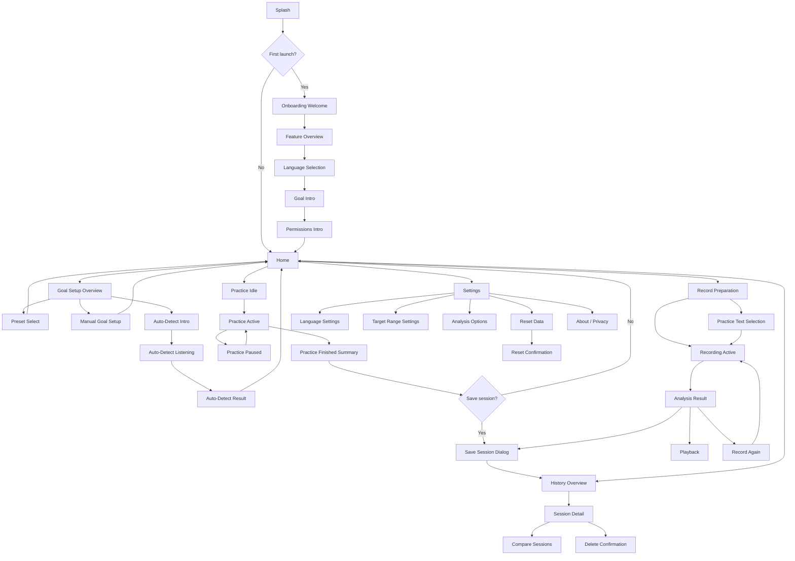
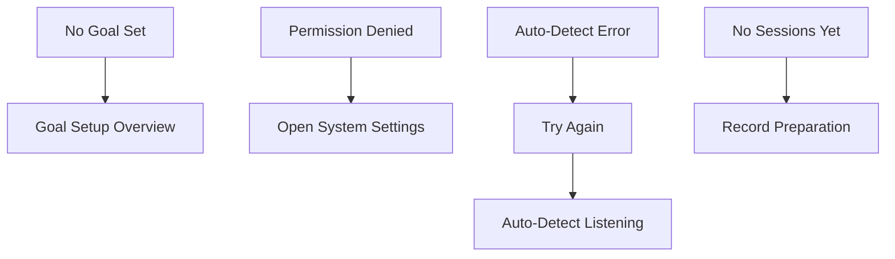

# Voxa – Pages, Page Content & Flow Diagram

## Zweck dieses Dokuments

Dieses Dokument beschreibt die komplette Informationsarchitektur von **Voxa**:
- alle Hauptseiten
- alle relevanten Subpages / Dialoge / States
- den inhaltlichen Aufbau jeder Seite
- Beispieltexte für **Deutsch** und **Englisch**
- den zentralen User Flow als Mermaid-Diagramm

Voxa ist eine moderne, affirmierende Voice-Training-App für trans* Personen. Die App soll ruhig, präzise, inklusiv und technisch hochwertig wirken.

---

## App-Struktur auf einen Blick

### Hauptnavigation
1. Home
2. Practice
3. History
4. Settings

### Zusätzliche Flows
- Splash
- Onboarding
- Goal Setup
- Auto-Detect
- Record & Analyse
- Session Detail
- Compare Sessions
- Permissions
- Reset Confirmation
- Empty / Error States

---

# 1. Global Navigation & Shell

## App Shell

### Enthält
- Top App Bar oder großer Screen Header
- Hauptinhalt
- Bottom Navigation mit 4 Tabs
- modale Dialoge / Bottom Sheets je nach Flow

### Bottom Navigation Inhalte
**Deutsch**
- Home
- Üben
- Verlauf
- Einstellungen

**English**
- Home
- Practice
- History
- Settings

### Bottom Navigation Icons
- Home: Haus / Start
- Practice: Wellenform / Pitch-Line
- History: Verlauf / Uhr / Diagramm
- Settings: Zahnrad

---

# 2. Splash / Launch Screen

## Zweck
- kurzer Markenmoment beim Start
- App lädt initiale Daten / Preferences

## Inhalte
- Voxa Logo zentriert
- weicher Hintergrund mit Violet-Teal-Gradient
- optional subtile Glow-Fläche
- kein überladener Text

## Text
**Deutsch**
- Voxa

**English**
- Voxa

## Aktionen
- keine direkte Interaktion
- automatischer Übergang zu Onboarding oder Home

---

# 3. Onboarding

## 3.1 Welcome Screen

### Zweck
- Nutzer:innen willkommen heißen
- Grundidee der App erklären

### Inhalte
- Logo
- Headline
- kurzer beschreibender Text
- Primary CTA
- Secondary CTA: überspringen

### Text
**Deutsch**
- Titel: „Willkommen bei Voxa“
- Beschreibung: „Trainiere deine Stimme in deinem Tempo, erhalte klares Feedback und verfolge deinen Fortschritt.“
- Primärbutton: „Loslegen“
- Sekundärbutton: „Überspringen“

**English**
- Title: “Welcome to Voxa”
- Description: “Train your voice at your own pace, get clear feedback, and track your progress.”
- Primary button: “Get started”
- Secondary button: “Skip”

---

## 3.2 Feature Overview

### Zweck
- Kernfunktionen verständlich machen

### Inhalte
3 Karten oder Segmente:
1. Zielbereich festlegen
2. Live üben
3. Aufnehmen & Fortschritt vergleichen

### Text
**Deutsch**
- Karte 1 Titel: „Zielbereich festlegen“
- Karte 1 Text: „Wähle einen Preset-Bereich oder lege deinen Bereich in Hz selbst fest.“

- Karte 2 Titel: „Live üben“
- Karte 2 Text: „Sieh in Echtzeit, wo deine Stimme liegt, und erhalte direktes Feedback.“

- Karte 3 Titel: „Fortschritt sehen“
- Karte 3 Text: „Speichere Sessions, analysiere Werte und vergleiche Aufnahmen miteinander.“

- Primärbutton: „Weiter“

**English**
- Card 1 Title: “Set your target range”
- Card 1 Text: “Choose a preset or define your own target range in Hz.”

- Card 2 Title: “Practice live”
- Card 2 Text: “See your pitch in real time and get direct feedback.”

- Card 3 Title: “Track progress”
- Card 3 Text: “Save sessions, analyze stats, and compare recordings over time.”

- Primary button: “Continue”

---

## 3.3 Language Selection

### Zweck
- Sprache zu Beginn festlegen

### Inhalte
- Titel
- kurzer Hinweis
- zwei Sprachkarten oder Segment-Control
- Weiterbutton

### Text
**Deutsch**
- Titel: „Sprache auswählen“
- Text: „Du kannst die Sprache jederzeit in den Einstellungen ändern.“
- Optionen: „Deutsch“, „English“
- Button: „Weiter“

**English**
- Title: “Choose language”
- Text: “You can change the language anytime in Settings.”
- Options: “Deutsch”, “English”
- Button: “Continue”

---

## 3.4 Goal Intro

### Zweck
- Zielbereiche erklären
- Presets einführen

### Inhalte
- Headline
- kurzer Text
- Erklärung zu Presets
- Hinweis auf Individualität
- CTA

### Text
**Deutsch**
- Titel: „Lege deinen Zielbereich fest“
- Text: „Du kannst einen Preset-Bereich wählen, deinen Bereich selbst einstellen oder Voxa einen Vorschlag machen lassen.“
- Hinweis: „Alle Bereiche sind nur Orientierungshilfen und können jederzeit angepasst werden.“
- Button: „Zielbereich wählen“

**English**
- Title: “Set your target range”
- Text: “Choose a preset, set your own range, or let Voxa suggest one.”
- Note: “All ranges are guidance only and can be adjusted anytime.”
- Button: “Choose target range”

---

## 3.5 Permissions Intro

### Zweck
- Mikrofonberechtigung erklären

### Inhalte
- Icon / Illustration
- Titel
- erklärender Text
- Button für Berechtigung
- Sekundäre Option: später

### Text
**Deutsch**
- Titel: „Mikrofonzugriff erlauben“
- Text: „Voxa benötigt Zugriff auf dein Mikrofon, um deine Tonhöhe in Echtzeit zu messen und Aufnahmen zu analysieren.“
- Primärbutton: „Mikrofon aktivieren“
- Sekundärbutton: „Später“

**English**
- Title: “Enable microphone access”
- Text: “Voxa needs microphone access to detect your pitch in real time and analyze recordings.”
- Primary button: “Enable microphone”
- Secondary button: “Later”

---

# 4. Home / Dashboard

## Zweck
- zentrale Startseite
- aktueller Status + Schnellzugriffe

## Inhalte
1. Begrüßung
2. Zielbereichs-Karte
3. Schnellaktionen
4. Letzte Session / Fortschritt
5. optional kurze History Preview

## 4.1 Header
**Deutsch**
- „Schön, dass du da bist“
- optional kleinere Zeile: „Bereit für deine nächste Session?“

**English**
- “Good to see you”
- optional smaller line: “Ready for your next session?”

## 4.2 Goal Range Card
### Inhalte
- Titel
- aktueller Zielbereich
- Quelle: Preset / Custom / Auto-Detect
- Action: Bearbeiten

### Text
**Deutsch**
- Titel: „Dein Zielbereich“
- Wert: z. B. „150–185 Hz“
- Zusatz: „Androgynous preset“ / „Individueller Bereich“ / „Auto-detect“
- Button / Link: „Bearbeiten“

**English**
- Title: “Your target range”
- Value: e.g. “150–185 Hz”
- Subtext: “Androgynous preset” / “Custom range” / “Auto-detect”
- Button / Link: “Edit”

## 4.3 Quick Actions
### Aktionen
- Start Practice
- Record Session

### Text
**Deutsch**
- Primärbutton: „Übung starten“
- Sekundärbutton: „Session aufnehmen“

**English**
- Primary button: “Start practice”
- Secondary button: “Record session”

## 4.4 Last Session Card
### Inhalte
- Titel
- Datum / letzter Übungszeitpunkt
- durchschnittliche Tonhöhe
- Zeit im Zielbereich
- Action: ansehen

### Text
**Deutsch**
- Titel: „Letzte Session“
- Datum: „Heute, 18:42“
- Wert 1: „Ø 174 Hz“
- Wert 2: „72 % im Zielbereich“
- Link: „Details ansehen“

**English**
- Title: “Last session”
- Date: “Today, 6:42 PM”
- Value 1: “Avg 174 Hz”
- Value 2: “72% in range”
- Link: “View details”

## 4.5 History Preview
### Inhalte
- 2–3 letzte Sessions als Mini-Liste
- CTA zum Verlauf

### Text
**Deutsch**
- Titel: „Verlauf“
- Link: „Alle Sessions ansehen“

**English**
- Title: “History”
- Link: “View all sessions”

## Zustände
- ohne Zielbereich → Hinweis-Karte „Noch kein Zielbereich gesetzt“
- ohne Sessions → freundliche Empty State

---

# 5. Goal Setting

## 5.1 Goal Setup Overview

### Zweck
- zentrale Auswahl aller Methoden

### Inhalte
- Titel
- Erklärung
- Auswahlkarten:
  - Feminine
  - Masculine
  - Androgynous
  - Custom
  - Auto-detect

### Text
**Deutsch**
- Titel: „Zielbereich festlegen“
- Beschreibung: „Wähle einen Preset-Bereich, stelle deinen Bereich manuell ein oder lass Voxa einen Vorschlag machen.“

**Preset-Karten**
- „Feminine“ – „180–255 Hz“
- „Androgynous“ – „150–185 Hz“
- „Masculine“ – „85–155 Hz“
- „Custom“ – „Bereich selbst einstellen“
- „Auto-detect“ – „Voxa schlägt einen Bereich auf Basis deiner Stimme vor“

**English**
- Title: “Set your target range”
- Description: “Choose a preset, set your range manually, or let Voxa suggest one.”

**Preset cards**
- “Feminine” – “180–255 Hz”
- “Androgynous” – “150–185 Hz”
- “Masculine” – “85–155 Hz”
- “Custom” – “Set your own range”
- “Auto-detect” – “Let Voxa suggest a range based on your voice”

---

## 5.2 Manual Goal Setup

### Zweck
- Min- und Max-Hz manuell festlegen

### Inhalte
- Titel
- Erklärung
- Eingabefelder oder Slider für Minimum und Maximum
- visuelle Vorschau
- Speichern-Button

### Text
**Deutsch**
- Titel: „Individuellen Bereich einstellen“
- Feld 1: „Minimum (Hz)“
- Feld 2: „Maximum (Hz)“
- Hinweis: „Dieser Bereich dient als persönlicher Trainingsbereich und kann jederzeit geändert werden.“
- Button: „Speichern“

**English**
- Title: “Set a custom range”
- Field 1: “Minimum (Hz)”
- Field 2: “Maximum (Hz)”
- Note: “This range is your personal training target and can be changed anytime.”
- Button: “Save”

---

## 5.3 Auto-Detect Intro

### Zweck
- Auto-Detect vorbereiten

### Inhalte
- Titel
- kurze Erklärung
- Start-Button

### Text
**Deutsch**
- Titel: „Automatische Erkennung“
- Text: „Sprich für einige Sekunden normal. Voxa analysiert deine aktuelle Tonhöhe und schlägt einen Zielbereich vor.“
- Button: „Erkennung starten“

**English**
- Title: “Auto-detect”
- Text: “Speak naturally for a few seconds. Voxa will analyze your current pitch and suggest a target range.”
- Button: “Start detection”

---

## 5.4 Auto-Detect Listening

### Zweck
- aktive Messung

### Inhalte
- Listening-Animation / Waveform
- Countdown oder Fortschritt
- Status-Text
- Abbrechen

### Text
**Deutsch**
- Titel: „Wir hören zu“
- Text: „Bitte sprich ganz normal.“
- Fortschritt: „Noch 4 Sekunden“
- Button: „Abbrechen“

**English**
- Title: “Listening”
- Text: “Please speak naturally.”
- Progress: “4 seconds left”
- Button: “Cancel”

---

## 5.5 Auto-Detect Result

### Zweck
- vorgeschlagenen Bereich anzeigen

### Inhalte
- Titel
- vorgeschlagener Bereich
- kurzer unterstützender Text
- Buttons: Übernehmen / Anpassen / Erneut messen

### Text
**Deutsch**
- Titel: „Vorgeschlagener Bereich“
- Wert: z. B. „150–185 Hz“
- Text: „Du kannst diesen Bereich übernehmen oder jederzeit anpassen.“
- Buttons:
  - „Übernehmen“
  - „Anpassen“
  - „Erneut messen“

**English**
- Title: “Suggested range”
- Value: e.g. “150–185 Hz”
- Text: “You can use this range or adjust it anytime.”
- Buttons:
  - “Use this range”
  - “Adjust”
  - “Measure again”

---

# 6. Practice

## 6.1 Practice Idle

### Zweck
- Einstieg in Live-Training

### Inhalte
- Titel
- kurzer Hinweis
- Diagramm im Idle-State
- Zielbereich sichtbar
- Start-Button

### Text
**Deutsch**
- Titel: „Üben“
- Status: „Live-Feedback“
- Text: „Starte eine Session, um deine Tonhöhe in Echtzeit zu sehen.“
- Button: „Übung starten“

**English**
- Title: “Practice”
- Status: “Live feedback”
- Text: “Start a session to see your pitch in real time.”
- Button: “Start practice”

---

## 6.2 Practice Active

### Zweck
- Live-Training in Echtzeit

### Hauptinhalt
1. Header
2. Live-Diagramm
3. bewegliche Hz-Bubble
4. Live-Stats
5. Tip-Card
6. Pause / Stop

## 6.2.1 Header
**Deutsch**
- Titel: „Üben“
- Status: „Live-Feedback“

**English**
- Title: “Practice”
- Status: “Live feedback”

## 6.2.2 Live-Diagramm
### Inhalte
- y-Achse von 50 bis 400 Hz
- Zeit auf der x-Achse
- sanfte farbige Randverläufe:
  - unterer Rand: Koralle / Rot für low
  - mittlerer Bereich: dezentes Grün für target
  - oberer Rand: Blau für high
- aktuelle Pitch-Linie
- Target Range sichtbar
- Beschriftete Orientierung rechts oder im Overlay:
  - Masculine 85–155 Hz
  - Androgynous 150–185 Hz
  - Feminine 180–255 Hz

## 6.2.3 Bewegliche Hz-Bubble
### Inhalte
- große Zahl, z. B. „183 Hz“
- Bubble-Hintergrund je nach Zone
- optional Pfeil:
  - Pfeil nach oben = höher
  - Pfeil nach unten = tiefer
  - kein Pfeil = im Zielbereich

### Beispieltexte
**Deutsch**
- „183 Hz“
- Pfeil hoch / runter ohne zusätzlichen Text

**English**
- “183 Hz”
- arrow only

## 6.2.4 Live-Stats
### Inhalte
- Prozent im Zielbereich
- Durchschnittspitch
- Session-Dauer

### Text
**Deutsch**
- „Im Zielbereich“
- „Ø Tonhöhe“
- „Dauer“

**Beispielwerte**
- „72 %“
- „174 Hz“
- „02:48“

**English**
- “In range”
- “Avg. pitch”
- “Duration”

**Example values**
- “72%”
- “174 Hz”
- “02:48”

## 6.2.5 Tip-Card
### Inhalte
- kurzer, kontextsensitiver Hinweis

### Beispieltexte Deutsch
- „Du bist gerade nah an deinem Zielbereich.“
- „Versuche, etwas höher und stabiler zu bleiben.“
- „Halte die Tonhöhe etwas gleichmäßiger.“

### Example texts English
- “You’re close to your target range.”
- “Try to stay a little higher and more stable.”
- “Try to keep the pitch a bit more even.”

## 6.2.6 Controls
**Deutsch**
- „Pausieren“
- „Beenden“

**English**
- “Pause”
- “Finish”

---

## 6.3 Practice Paused

### Inhalte
- Diagramm eingefroren
- Status
- Buttons: Fortsetzen / Beenden

### Text
**Deutsch**
- Status: „Pausiert“
- Button 1: „Fortsetzen“
- Button 2: „Beenden“

**English**
- Status: “Paused”
- Button 1: “Resume”
- Button 2: “Finish”

---

## 6.4 Practice Finished Summary

### Inhalte
- kurze Zusammenfassung
- Zeit im Zielbereich
- Durchschnittspitch
- Dauer
- Speichern / Verwerfen

### Text
**Deutsch**
- Titel: „Session beendet“
- Text: „Das war eine starke Session.“
- Werte:
  - „72 % im Zielbereich“
  - „Ø 174 Hz“
  - „02:48 Dauer“
- Buttons:
  - „Speichern“
  - „Verwerfen“

**English**
- Title: “Session finished”
- Text: “That was a strong session.”
- Values:
  - “72% in range”
  - “Avg 174 Hz”
  - “Duration 02:48”
- Buttons:
  - “Save”
  - “Discard”

---

# 7. Record & Analyse

## 7.1 Record Preparation

### Zweck
- Aufnahme vorbereiten

### Inhalte
- Titel
- Erklärung
- Textauswahl / freie Sprache
- Start-Button

### Text
**Deutsch**
- Titel: „Session aufnehmen“
- Text: „Wähle einen Übungstext oder sprich frei. Danach analysiert Voxa deine Aufnahme.“
- Option 1: „Übungstext wählen“
- Option 2: „Frei sprechen“
- Button: „Aufnahme starten“

**English**
- Title: “Record a session”
- Text: “Choose a practice text or speak freely. Voxa will analyze your recording afterwards.”
- Option 1: “Choose practice text”
- Option 2: “Free speech”
- Button: “Start recording”

---

## 7.2 Practice Text Selection

### Inhalte
- Liste vorgegebener Texte
- Kategorien
- Auswählen-Action

### Kategorien
**Deutsch**
- „Alltag“
- „Kurze Sätze“
- „Längerer Lesetext“

**English**
- “Everyday”
- “Short phrases”
- “Longer reading text”

### Beispiel-Listeneinträge
**Deutsch**
- „Guten Morgen, wie geht es dir heute?“
- „Ich bin auf dem Weg zur Arbeit.“
- „Heute ist ein guter Tag, um etwas Neues auszuprobieren.“

**English**
- “Good morning, how are you today?”
- “I’m on my way to work.”
- “Today is a good day to try something new.”

---

## 7.3 Recording Active

### Inhalte
- großer Recording-Status
- Timer
- Live-Waveform
- optional kleine Live-Pitch-Anzeige
- Pause / Stop

### Text
**Deutsch**
- Titel: „Aufnahme läuft“
- Status: „Recording“
- Timer: „00:18“
- Button 1: „Pausieren“
- Button 2: „Stoppen“

**English**
- Title: “Recording”
- Status: “Recording”
- Timer: “00:18”
- Button 1: “Pause”
- Button 2: “Stop”

---

## 7.4 Analysis Result

### Inhalte
- große Stat-Karten
- Chart
- kurzer Insight-Block
- Playback
- Speichern / Neu aufnehmen

### Stat-Karten
**Deutsch**
- „Ø Tonhöhe“
- „Minimum“
- „Maximum“
- „Im Zielbereich“

**English**
- “Average pitch”
- “Minimum”
- “Maximum”
- “In range”

### Beispielwerte
- 174 Hz
- 161 Hz
- 191 Hz
- 68 %

### Insight-Texte Deutsch
- „Deine Tonhöhe lag über weite Strecken stabil im Zielbereich.“
- „Am Anfang war die Tonhöhe etwas niedriger, später wurde sie gleichmäßiger.“

### Insight Texts English
- “Your pitch stayed stable in your target range for much of the session.”
- “Your pitch started a bit lower and became more even later on.”

### Buttons
**Deutsch**
- „Wiedergabe“
- „Speichern“
- „Erneut aufnehmen“

**English**
- “Playback”
- “Save”
- “Record again”

---

## 7.5 Playback View

### Inhalte
- Audio-Player
- Play / Pause
- Scrubber
- optional synchronisierte Pitch-Kurve

### Text
**Deutsch**
- Titel: „Wiedergabe“
- Button: „Play“ / „Pause“

**English**
- Title: “Playback”
- Button: “Play” / “Pause”

---

## 7.6 Save Session Dialog

### Inhalte
- Dialogtitel
- optional Name
- Info über Typ / Datum
- Buttons

### Text
**Deutsch**
- Titel: „Session speichern“
- Feld: „Name (optional)“
- Info: „Datum wird automatisch gespeichert.“
- Button 1: „Speichern“
- Button 2: „Abbrechen“

**English**
- Title: “Save session”
- Field: “Name (optional)”
- Info: “The date will be saved automatically.”
- Button 1: “Save”
- Button 2: “Cancel”

---

# 8. History

## 8.1 History Overview

### Zweck
- alle Sessions zeigen

### Inhalte
- Titel
- Such-/Filterbereich optional
- Liste von Session-Karten

### Header Text
**Deutsch**
- Titel: „Verlauf“

**English**
- Title: “History”

### Session-Karte Inhalte
- Datum
- Typ
- Durchschnittspitch
- Zeit im Zielbereich
- Mini-Chart
- Action: öffnen

### Beispielkarte Deutsch
- „Heute, 18:42“
- „Practice“
- „Ø 174 Hz“
- „72 % im Zielbereich“

### Example card English
- “Today, 6:42 PM”
- “Practice”
- “Avg 174 Hz”
- “72% in range”

---

## 8.2 History Empty State

### Inhalte
- Illustration
- freundlicher Hinweis
- CTA

### Text
**Deutsch**
- Titel: „Noch keine Sessions“
- Text: „Sobald du eine Session speicherst, erscheint sie hier.“
- Button: „Erste Session aufnehmen“

**English**
- Title: “No sessions yet”
- Text: “Saved sessions will appear here.”
- Button: “Record your first session”

---

## 8.3 Session Detail

### Inhalte
- Titel
- Datum
- Typ
- Full Stats
- großes Pitch-Chart
- Zielbereich
- Wiedergabe falls vorhanden
- Compare / Delete Aktionen

### Texte
**Deutsch**
- Titel: „Session-Details“
- Bereichstitel:
  - „Statistiken“
  - „Pitch-Verlauf“
  - „Zielbereich“
- Aktionen:
  - „Vergleichen“
  - „Löschen“

**English**
- Title: “Session details”
- Section titles:
  - “Statistics”
  - “Pitch chart”
  - “Target range”
- Actions:
  - “Compare”
  - “Delete”

---

## 8.4 Compare Sessions

### Inhalte
- Auswahl zweier Sessions
- Vergleichsdiagramm
- Gegenüberstellung der Kennzahlen
- Primäre Vergleichsfarben: Violet und Teal

### Text
**Deutsch**
- Titel: „Sessions vergleichen“
- Auswahl 1: „Session A“
- Auswahl 2: „Session B“
- Werte:
  - „Ø Tonhöhe“
  - „Im Zielbereich“
  - „Dauer“

**English**
- Title: “Compare sessions”
- Selection 1: “Session A”
- Selection 2: “Session B”
- Values:
  - “Average pitch”
  - “In range”
  - “Duration”

---

## 8.5 Delete Confirmation

### Inhalte
- Warnhinweis
- Folgen erklären
- Löschen / Abbrechen

### Text
**Deutsch**
- Titel: „Session löschen?“
- Text: „Diese Aktion kann nicht rückgängig gemacht werden.“
- Button 1: „Löschen“
- Button 2: „Abbrechen“

**English**
- Title: “Delete session?”
- Text: “This action cannot be undone.”
- Button 1: “Delete”
- Button 2: “Cancel”

---

# 9. Settings

## 9.1 Settings Overview

### Inhalte
- Sprache
- Zielbereich
- Analyseoptionen
- Datenverwaltung
- About / Datenschutz / Version

### Text
**Deutsch**
- Titel: „Einstellungen“
- Bereiche:
  - „Sprache“
  - „Zielbereich“
  - „Analyseoptionen“
  - „Daten“
  - „Über Voxa“

**English**
- Title: “Settings”
- Sections:
  - “Language”
  - “Target range”
  - “Analysis options”
  - “Data”
  - “About Voxa”

---

## 9.2 Language Settings

### Inhalte
- Segment-Control oder Liste
- aktuelle Auswahl
- Speichern ggf. direkt automatisch

### Text
**Deutsch**
- Titel: „Sprache“
- Optionen: „Deutsch“, „English“

**English**
- Title: “Language”
- Options: “Deutsch”, “English”

---

## 9.3 Target Range Settings

### Inhalte
- aktueller Bereich
- Link zurück in Goal Setup

### Text
**Deutsch**
- Titel: „Zielbereich“
- Wert: „150–185 Hz“
- Action: „Zielbereich ändern“

**English**
- Title: “Target range”
- Value: “150–185 Hz”
- Action: “Change target range”

---

## 9.4 Analysis Options

### Inhalte
- Realtime Analysis Toggle
- Audio-Speicherung falls angeboten
- weitere zukünftige Optionen

### Text
**Deutsch**
- Titel: „Analyseoptionen“
- Toggle: „Echtzeit-Analyse während der Aufnahme“
- Toggle: „Audio zusammen mit Session speichern“

**English**
- Title: “Analysis options”
- Toggle: “Realtime analysis during recording”
- Toggle: “Save audio with session”

---

## 9.5 Reset Data

### Inhalte
- gefährliche Aktion
- klarer Hinweis
- CTA

### Text
**Deutsch**
- Titel: „Daten zurücksetzen“
- Text: „Alle gespeicherten Sessions und Einstellungen werden entfernt.“
- Button: „Alle Daten zurücksetzen“

**English**
- Title: “Reset data”
- Text: “All saved sessions and settings will be removed.”
- Button: “Reset all data”

---

## 9.6 Reset Confirmation

### Inhalte
- Dialogtitel
- Erklärung
- Reset / Cancel

### Text
**Deutsch**
- Titel: „Alle Daten zurücksetzen?“
- Text: „Diese Aktion entfernt alle gespeicherten Sessions und kann nicht rückgängig gemacht werden.“
- Button 1: „Zurücksetzen“
- Button 2: „Abbrechen“

**English**
- Title: “Reset all data?”
- Text: “This will remove all saved sessions and cannot be undone.”
- Button 1: “Reset”
- Button 2: “Cancel”

---

## 9.7 About / Privacy

### Inhalte
- kurze Produktbeschreibung
- Datenschutz
- Speicherhinweis
- Versionsnummer

### Text
**Deutsch**
- Titel: „Über Voxa“
- Beschreibung: „Voxa ist eine Voice-Training-App, die dich beim bewussten Erkunden, Trainieren und Analysieren deiner Stimme unterstützt.“
- Datenschutz: „Deine Daten werden lokal auf deinem Gerät gespeichert, sofern nicht anders angegeben.“
- Version: „Version 1.0.0“

**English**
- Title: “About Voxa”
- Description: “Voxa is a voice training app that supports you in exploring, training, and analyzing your voice.”
- Privacy: “Your data is stored locally on your device unless stated otherwise.”
- Version: “Version 1.0.0”

---

# 10. System States

## 10.1 No Goal Set Yet
**Deutsch**
- Titel: „Noch kein Zielbereich gesetzt“
- Text: „Lege zuerst einen Zielbereich fest, um mit dem Training zu starten.“
- Button: „Zielbereich festlegen“

**English**
- Title: “No target range set”
- Text: “Set a target range first to begin training.”
- Button: “Set target range”

---

## 10.2 Permission Denied
**Deutsch**
- Titel: „Mikrofonzugriff erforderlich“
- Text: „Bitte erlaube den Mikrofonzugriff in den Systemeinstellungen, damit Voxa deine Stimme analysieren kann.“
- Button 1: „Einstellungen öffnen“
- Button 2: „Später“

**English**
- Title: “Microphone access required”
- Text: “Please allow microphone access in system settings so Voxa can analyze your voice.”
- Button 1: “Open settings”
- Button 2: “Later”

---

## 10.3 Auto-Detect Error
**Deutsch**
- Titel: „Erkennung nicht möglich“
- Text: „Die Messung konnte nicht eindeutig durchgeführt werden. Bitte versuche es erneut.“
- Button: „Erneut versuchen“

**English**
- Title: “Detection failed”
- Text: “The measurement could not be completed clearly. Please try again.”
- Button: “Try again”

---

## 10.4 Generic Loading State
**Deutsch**
- „Wird geladen …“

**English**
- “Loading…”

---

# 11. Future Placeholder Pages

Diese Seiten müssen noch nicht vollständig umgesetzt werden, sollten aber im Designsystem mitgedacht werden.

## 11.1 Resonance Training
**Deutsch**
- „Resonanztraining“
- „Demnächst verfügbar“

**English**
- “Resonance training”
- “Coming soon”

## 11.2 Intonation Patterns
**Deutsch**
- „Intonationsmuster“
- „Demnächst verfügbar“

**English**
- “Intonation patterns”
- “Coming soon”

## 11.3 Sustained Note Training
**Deutsch**
- „Gehaltene Tonhöhe“
- „Demnächst verfügbar“

**English**
- “Sustained note training”
- “Coming soon”

## 11.4 Daily Check-in
**Deutsch**
- „Täglicher Check-in“
- „Demnächst verfügbar“

**English**
- “Daily check-in”
- “Coming soon”

## 11.5 Guided Exercise Program
**Deutsch**
- „Geführtes Übungsprogramm“
- „Demnächst verfügbar“

**English**
- “Guided exercise program”
- “Coming soon”

## 11.6 Emotion Exercises
**Deutsch**
- „Emotionsübungen“
- „Demnächst verfügbar“

**English**
- “Emotion exercises”
- “Coming soon”

---

# 12. Flow Diagramm

## Hauptflow

## Fehler- und Sonderzustände

---

# 13. Empfohlene Reihenfolge für Mockups / Umsetzung

1. Splash
2. Onboarding Welcome
3. Feature Overview
4. Language Selection
5. Goal Setup Overview
6. Manual Goal Setup
7. Auto-Detect Listening
8. Auto-Detect Result
9. Home
10. Practice Idle
11. Practice Active
12. Practice Finished Summary
13. Record Preparation
14. Recording Active
15. Analysis Result
16. History Overview
17. Session Detail
18. Compare Sessions
19. Settings
20. Reset Confirmation
21. Permission Denied
22. Empty States

---

# 14. Kurzfazit

Dieses Dokument bildet die vollständige Seitenstruktur von Voxa ab, inklusive:
- Hauptseiten
- Subflows
- Inhalte und Beispieltexte
- Zustände
- zentrale User Flows

Es eignet sich als Grundlage für:
- UI/UX-Konzept
- Mockups
- Flutter-Routing
- Product Spec
- Content Design
